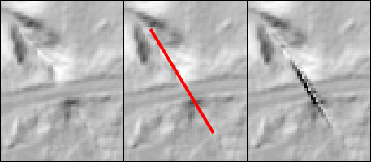
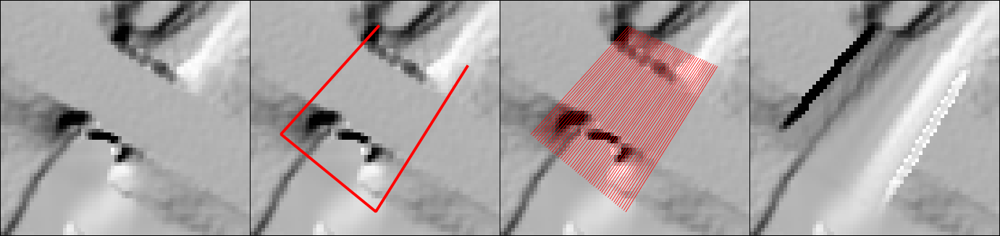

# DHM Hydro Adjust

Tools to burn hydrological adjustment objects into a DEM raster.

## Background

These tools are intended to modify a DEM raster to ensure that it is
meaningful for hydrological uses. In particular, it is desired that water can
flow uninterrupted through culverts, under bridges etc.

The tools take as input a DEM raster (which should have appropriate elevation
in waterbody surfaces), as well as two kinds of vector "adjustment objects":

- **Line objects**, linestring objects consisting of exactly one line segment
each
- **Horseshoe objects**, linestring objects consisting of exactly three line
segments each

For line objects, the input raster is sampled in each endpoint, and the linear
interpolation between those is burned into the raster, creating a "canal" at
least one pixel wide along the line segment.

For horseshoe objects, two profiles (typically one on each side of a bridge)
are sampled from the raster, and the linear interpolation between those
profiles is burned into the raster. More precisely, a horseshoe object
consists of a linestring connecting points ABCD, with an "open" profile AD and
a "closed" profile BC. Each of those two profiles is sampled in the raster at
a user-configurable density, and the bilinear interpolation between them is
burned into the raster.

In order to work around the complexities of inverse bilinear interpolation,
the horseshoe objects are currently rendered by creating a grill-like pattern
of profile-to-profile line segments with endpoints of appropriate elevation.
Those line segments can then be burned into the raster in a manner similar to
the line objects.



*Adjustment with line object, left to right: original DTM, line object, adjusted DTM*



*Adjustment with horseshoe object, left to right: original DTM, horseshoe object, horseshoe object rendered as lines, adjusted DTM*

## Installation

A Python 3 environment with GDAL, NumPy, SciPy and tqdm is required. To run
the tests, pytest is also required. A suitable Conda environment (here called
"hydroadjust") can be created with:

```
conda env create -n hydroadjust -f environment.yml
```

For now, the tools support editable installation using `pip`. To install this
way, use the following command in the root directory:

```
pip install -e .
```

## Usage

The DEM raster is assumed to be divided into tiles, and since adjustment
objects may straddle tile boundaries, it is generally necessary to sample the
DEM in an area larger than the tile to burn into. In order to most
conveniently handle this, the recommended workflow is conceptually a two-step
process:

1. Sample a DEM VRT for the provided (2D) adjustment objects, creating
intermediate "ready-to-burn" vector objects with appropriate elevation data
2. For each tile, create a copy with those "ready-to-burn" objects burned in

**Please note that the command-line interface for these tools is not
stabilized yet. Expect breaking changes.**

### Preparing line objects for burning

```
sample_line_z [-h] input_raster input_lines output_lines
```

| Parameter | Description |
| --------- | ----------- |
| `input_raster` | Path to GDAL-readable raster dataset from which to sample elevation |
| `input_lines` | Path or connection string to OGR-readable datasource containing the input 2D line objects |
| `output_lines` | Path to file to write output elevation-sampled 3D line objects to. Will be written in gpkg format |
| `-h` | Print help and exit |

### Preparing horseshoe objects as lines for burning

```
sample_horseshoe_z_lines [-h] [--max-sample-dist MAX_SAMPLE_DIST] input_raster input_horseshoes output_lines
```

| Parameter | Description |
| --------- | ----------- |
| `input_raster` | Path to GDAL-readable raster dataset from which to sample elevation |
| `input_horseshoes` |  Path or connection string to OGR-readable datasource containing the input 2D horseshoe objects |
| `output_lines` | Path to file to write output elevation-sampled 3D line objects to. Will be written in gpkg format |
| `--max-sample-dist` | *(optional)* Maximum allowed sample distance (in georeferenced units) along profiles |
| `-h` | Print help and exit |

The horseshoe profile sampling density can be controlled with the optional
`--max-sample-dist` argument; for example, using `--max-sample-dist 0.1` will
require the horseshoe profiles to be sampled at least every 0.1 meters. In
order to avoid gaps in the resulting raster, it is recommended that the value
is chosen to be smaller than the diagonal (georeferenced) pixel size of the
raster to burn into. The default value is half the diagonal pixel size of the
provided input raster.

### Burning the prepared vector objects into a raster tile

```
burn_line_z [-h] lines input_raster output_raster
```

| Parameter | Description |
| --------- | ----------- |
| `lines` | Path or connection string to OGR-readable datasource containing one or more layers of LineStringZ objects to burn into raster |
| `input_raster` | Path to GDAL-readable raster dataset for input tile |
| `output_raster` | Path to write output raster tile to. Will be written in GeoTIFF format |
| `-h` | Print help and exit |

This will iterate through the layers of the datasource in `lines`, successively burning layers into the raster.

## Example workflow

As an example, the steps below illustrate preparing the relevant intermediate data and burning it into a raster tile. The example filenames below are:

| Example filename | Description |
| ---------------- | ----------- |
| ORIGINAL_DTM.vrt | Input VRT containing the original DEM (i.e. pre-adjustment) |
| ORIGINAL_DTM/1km_NNNN_EEE.tif | Input raster tile for which corresponding output will be produced. It is assumed this input tile is included in the VRT |
| LINE_OBJECTS.gpkg | Input 2D line objects |
| HORSESHOE_OBJECTS.gpkg | Input 2D horseshoe objects |
| LINES_WITH_Z.gpkg | Intermediate datasource of prepared 3D line objects |
| HORSESHOE_LINES_WITH_Z.gpkg | Intermediate datasource of horseshoes rendered as 3D lines |
| LINES_TO_BURN.gpkg | Intermediate datasource containing prepared 3D lines for both line objects and horseshoes, combined in one datasource |
| ADJUSTED_DTM/1km_NNNN_EEE.tif | Output raster tile, created from the input raster tile with 3D lines burned in |

Prepare 3D line objects:

```
sample_line_z ORIGINAL_DTM.vrt LINE_OBJECTS.gpkg LINES_WITH_Z.gpkg
```

Render horseshoes as 3D lines:

```
sample_horseshoe_z_lines ORIGINAL_DTM.vrt HORSESHOE_OBJECTS.gpkg HORSESHOE_LINES_WITH_Z.gpkg
```

Merge the rendered 3D lines into one datasource, using the `ogrmerge` tool from GDAL/OGR:

```
ogrmerge LINES_WITH_Z.gpkg HORSESHOE_LINES_WITH_Z.gpkg -o LINES_TO_BURN.gpkg
```

Create the adjusted DEM tile from the 3D lines and the original DEM tile:

```
burn_line_z LINES_TO_BURN.gpkg ORIGINAL_DTM/1km_NNNN_EEE.tif ADJUSTED_DTM/1km_NNNN_EEE.tif
```
